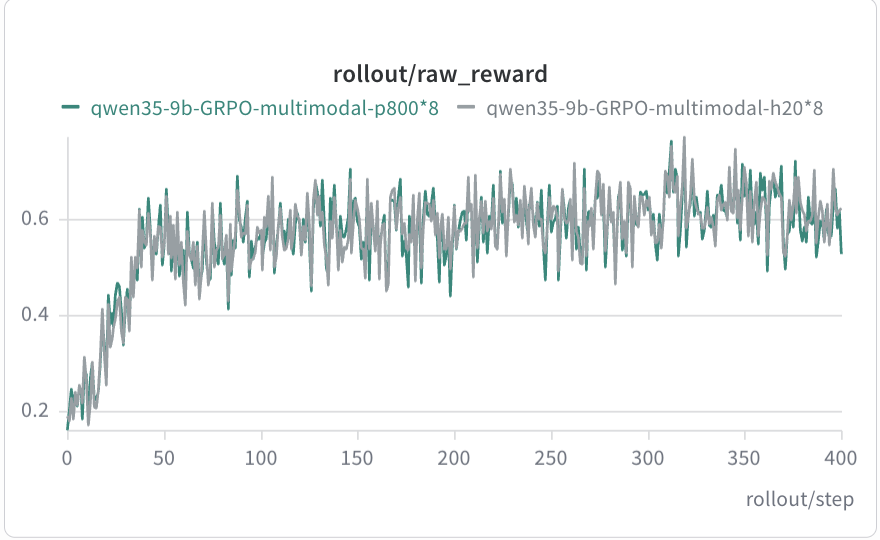
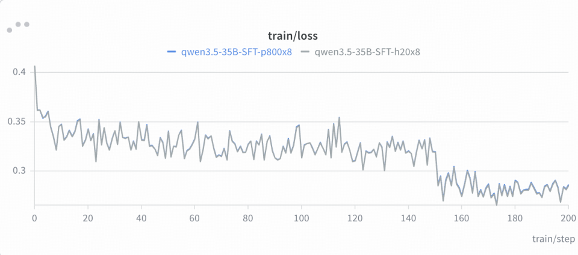

# 🚀 昆仑芯 P800 适配

Relax 已在昆仑芯 P800 上完成训练链路适配。当前公开验证覆盖**纯文本 RL、多模态 RL 与 SFT**，统一采用 colocate（同步）模式；在相同模型、数据集和超参下，P800 的 RL `raw_reward` 与 SFT `loss` 曲线均已与 GPU 基线对齐。

## ✅ 适配结论

- **硬件**：P800（8 卡单机；Qwen3.5-35B-A3B DAPO 支持 16 卡 / 两机）。
- **后端**：P800 设备抽象、Ray 资源识别、BKCL 通信与训推权重同步已接入主干。
- **模型范围**：Qwen3-4B、Qwen3.5-9B、Qwen3.5-35B-A3B、Qwen3.6-27B、Qwen3.6-35B-A3B，以及对应视觉语言模型。
- **精度**：公开 P800 脚本以 bf16 为主；框架已补齐 fp16 动态 loss scaling 的兼容处理。

## 📋 已验证脚本

| 场景 | 模型 | 资源 | 参考脚本 |
| :--- | :--- | :--- | :--- |
| DAPO RL | Qwen3-4B | 8 卡 | [`run-qwen3-4B-8xklx.sh`](../scripts/training/text/run-qwen3-4B-8xklx.sh) |
| DAPO RL | Qwen3.5-9B | 8 卡 | [`run-qwen35-9B-8xklx.sh`](../scripts/training/text/run-qwen35-9B-8xklx.sh) |
| DAPO RL | Qwen3.5-35B-A3B | 16 卡 / 两机 | [`run-qwen35-35B-A3B-16xklx.sh`](../scripts/training/text/run-qwen35-35B-A3B-16xklx.sh) |
| DAPO RL | Qwen3.6-27B | 8 卡 | [`run-qwen36-27B-8xklx.sh`](../scripts/training/text/run-qwen36-27B-8xklx.sh) |
| DAPO RL | Qwen3.6-35B-A3B | 8 卡 | [`run-qwen36-35B-A3B-8xklx.sh`](../scripts/training/text/run-qwen36-35B-A3B-8xklx.sh) |
| 多模态 RL | Qwen3.5-9B（VL） | 8 卡 | [`run-qwen35-9B-8xklx-openr1mm-sync.sh`](../scripts/training/multimodal/run-qwen35-9B-8xklx-openr1mm-sync.sh) |
| 多模态 RL | Qwen3.5-35B-A3B（VL） | 8 卡 | [`run-qwen35-35B-A3B-8xklx.sh`](../scripts/training/multimodal/run-qwen35-35B-A3B-8xklx.sh) |
| SFT | Qwen3.5-9B | 8 卡 | [`run-qwen3.5-9B-8xklx.sh`](../scripts/training/sft/run-qwen3.5-9B-8xklx.sh) |
| SFT | Qwen3.5-35B-A3B | 8 卡 | [`run-qwen3.5-35B-A3B-mtp-sft-8xklx.sh`](../scripts/training/sft/run-qwen3.5-35B-A3B-mtp-sft-8xklx.sh) |

## 📈 精度对齐

RL 以 `raw_reward`、SFT 以 `loss` 作为对齐指标。以下曲线来自相同模型、数据集和超参下的 P800 与 H20 对比，已适配任务的起点、走势和收敛水平保持一致。

| RL / SFT 对比 | 曲线 |
| :--- | :--- |
| Qwen3.5-9B DAPO |  |
| Qwen3.5-35B-A3B DAPO |  |
| Qwen3.5-9B 多模态 RL |  |
| Qwen3.5-35B-A3B SFT |  |
| Qwen3.5-35B-A3B 多模态 RL |  |

## 🧩 适配沉淀

P800 适配以硬件无关的方式回馈 Relax 主干：

1. **设备抽象**：`relax/utils/device.py` 增加 P800 设备识别，通过 `/dev/xpuctrl` 自动识别，并统一设备名、可见设备变量、Ray 资源名和通信后端。
2. **权重同步**：训推同步的 bridge / direct 转换链路与 checkpoint 更新接口解除 CUDA 假设，支持非 CUDA 后端。
3. **数值稳定性**：修复 fp16 动态 loss scaling 下溢出重试、重复 unscale 等问题，保证训练过程可观测、可恢复。

## ⚡ 快速开始

### 1. 🔍 准备环境

- P800 节点，容器内可见 `/dev/xpu0` … `/dev/xpu7` 与 `/dev/xpuctrl`。
- 已安装 P800 XPU/PyTorch 运行时。适配镜像示例：
  `iregistry.baidu-int.com/xpu/xrelax_torch29_ubuntu2204_xsgl0510_dev:20260630_12`。
- 训练前确认设备：

```bash
xpu_smi
xpu_smi -L | grep -c XPU
```

### 2. ▶️ 启动训练

将模型、数据集和 `EXP_DIR` 放在工作目录（默认 `/workspace`），进入 Relax 根目录后执行对应脚本：

```bash
cd /workspace/Relax
export MODEL_DIR=/workspace
export DATA_DIR=/workspace
export EXP_DIR=/workspace
bash scripts/training/text/run-qwen3-4B-8xklx.sh
```

多机任务使用 [`spmd-multinode.sh`](../scripts/entrypoint/spmd-multinode.sh) 启动；容器设备挂载、共享内存和网络参数参见本目录的 [`Dockerfile`](Dockerfile) 及脚本注释。

## 🧭 适配范围

当前验证集中在 colocate（同步）模式。Hybrid 与 Fully Async、更多 MoE / 多模态任务将随社区回归矩阵持续补齐。问题与新模型接入请通过 GitHub Issue / Pull Request 反馈。
